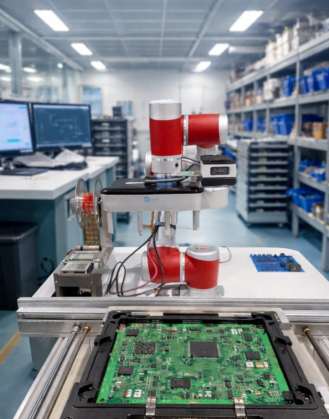
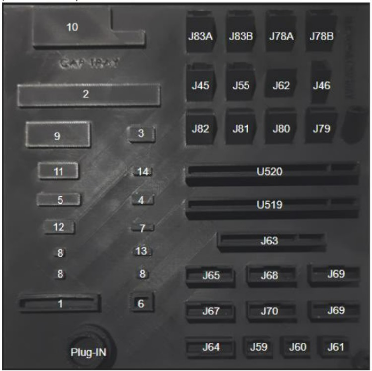
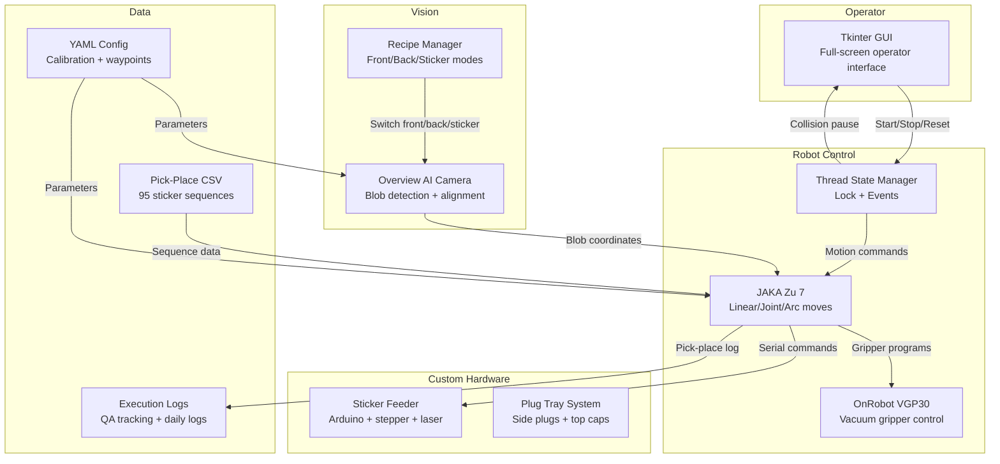
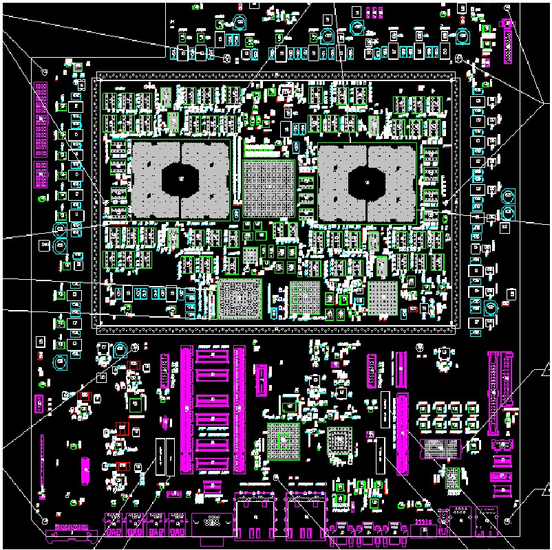
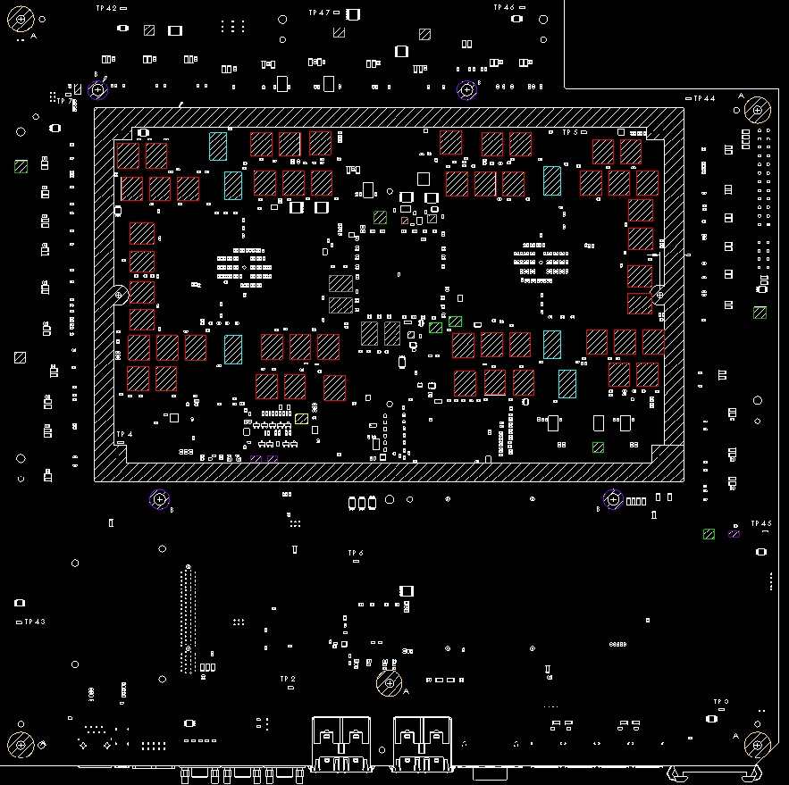

# Industrial Pick-and-Place Vision System

A production-grade automated PCB masking system that uses computer vision, a collaborative robot arm, and custom hardware to pick protective stickers from a feeder and precisely place them on circuit board components. Deployed in a real manufacturing environment, processing 95+ stickers per board cycle.

<p align="center">
  
  <br/>
  <em>Operator interface — fullscreen Tkinter GUI for production floor use</em>
</p>

## Hardware Stack

| Component | Model | Role |
|-----------|-------|------|
| **Cobot Arm** | [JAKA Zu 7](https://www.jaka.com/en/zu.html) | 6-DOF collaborative robot, 7 kg payload |
| **Vision Camera** | [Overview AI](https://overview.ai/) | Industrial vision with blob detection and alignment |
| **Vacuum Gripper** | [OnRobot VGP30](https://onrobot.com/en/products/vgp30-vacuum-gripper) | Configurable vacuum with multiple cup sizes |
| **Sticker Feeder** | Custom-built | Arduino-controlled stepper motor + IR laser for precision dispensing |
| **Vacuum Cups** | Custom adapters | 3mm (3D), 5mm (5C), 15mm (15B), 5mm right-angle (5RtA) |
| **Tray System** | Custom-built | Plug tray with labeled slots for side plugs and top caps |

<p align="center">
  
  <br/>
  <em>Custom plug tray with labeled component slots</em>
</p>

## System Architecture



## Pick-Place Pipeline

Each sticker goes through this cycle (~15 seconds per sticker):

```
1. DISPENSE    Arduino triggers stepper to advance sticker roll
      |
2. CAPTURE     Camera photographs sticker feeder (recipe: StickersNewTrigger)
      |         Filter blobs > 2100px, sort by area, select target sticker
      |
3. APPROACH    Arc move to offset position above sticker
      |         (accounts for vacuum adapter geometry)
      |
4. PICK        Linear move down, activate vacuum cup
      |         Run gripper program (e.g., 5C_45.jks)
      |         Relative move up with sticker
      |
5. VERIFY      Re-photograph feeder to confirm sticker was removed
      |         Compare blob count: expected = previous - 1
      |
6. TRANSIT     Waypoint navigation to PCB board area
      |         (avoids collision with feeder/tray)
      |
7. PLACE       Linear move to vision-corrected board position
      |         Apply 0°/90°/-90° rotation from CSV sequence
      |         Relative move down, release vacuum, retract
      |
8. LOG         Write sticker index + timestamp to QA CSV
```

## Vision Calibration

Before each board side, the system runs a calibration cycle:

```
For each vacuum adapter (15B, 5C, 3D):
    1. Move to shoot pose above PCB board
    2. Switch camera recipe (front=42, back=43)
    3. Capture alignment image
    4. Extract board center from alignment data
    5. Apply pixel-to-mm conversion factor
    6. Compute zero position, +90° position, -90° position
    7. Store corrected coordinates for pick-place loop
```

This corrects for board placement variation between runs, ensuring sub-millimeter sticker accuracy.

## PCB Board Reference

<p align="center">
  
  
  <br/>
  <em>Front board (48 stickers) and back board (47 stickers) — vision system reference images</em>
</p>

## Project Structure

```
industrial-pick-place-vision/
├── src/
│   ├── main.py                 # Entry point: config, init, launch GUI
│   ├── gui/
│   │   └── app.py              # Tkinter operator interface + process control
│   ├── robot/
│   │   ├── controller.py       # Low-level JAKA motion + Arduino comms
│   │   ├── workflow.py         # Pick-place pipeline + board handlers
│   │   └── state.py            # Thread-safe state (lock, events, globals)
│   ├── vision/
│   │   └── camera.py           # Overview AI capture, blob filter, recipe switch
│   └── utils/
│       └── logging.py          # Daily log rotation with 30-day retention
├── config/
│   ├── config.yaml             # Your system config (gitignored)
│   └── config.example.yaml     # Reference config with example values
├── firmware/
│   └── sticker_feeder/
│       └── sticker_feeder.ino  # Arduino stepper + laser control
├── sequences/
│   ├── front_example.csv       # Example front board sequence (48 stickers)
│   └── back_example.csv        # Example back board sequence (47 stickers)
├── assets/
│   ├── media/                  # System photos and screenshots
│   ├── gui/                    # GUI button images
│   └── qa_reference/           # Board reference images for QA overlay
├── docs/
│   └── architecture.md         # Detailed system architecture document
├── requirements.txt
└── LICENSE
```

## Thread Synchronization

The system uses a multi-threaded architecture for real-time collision safety:

```python
# Three synchronization primitives coordinate all subsystems:

lock = threading.Lock()         # Ensures only one process runs at a time
stop_event = threading.Event()  # Signals all threads to halt gracefully
pause_event = threading.Event() # Blocks motion when collision detected

# Collision monitor runs as a daemon thread (500ms polling):
#   collision detected  → pause_event.clear() → all motions block
#   collision cleared   → pause_event.set()   → motions resume
```

Every motion function checks `stop_event` before executing and calls `pause_event.wait()` to block during collisions.

## Quick Start

### Prerequisites

- Python 3.10+
- JAKA Zu 7 with SDK (`jkrc` library)
- Overview AI camera on the network
- Arduino with sticker feeder firmware

### Setup

```bash
git clone https://github.com/YOUR_USERNAME/industrial-pick-place-vision.git
cd industrial-pick-place-vision

python -m venv .venv
source .venv/bin/activate   # Windows: .venv\Scripts\activate

pip install -r requirements.txt

# Copy and edit the config
cp config/config.example.yaml config/config.yaml
# Edit config.yaml with your robot IP, camera IP, calibration values

# Upload Arduino firmware
# Open firmware/sticker_feeder/sticker_feeder.ino in Arduino IDE
# Upload to your Arduino board

# Run
python src/main.py
```

### Creating Pick-Place Sequences

See `sequences/README.md` for the CSV format. Each row defines one sticker placement with pick coordinates (sticker roll), place coordinates (PCB board offset from vision center), vacuum adapter type, and rotation.

## Key Design Decisions

**YAML config over `exec()` globals** — the original system used Python's `exec()` to load a `variables.txt` file into global scope. The refactored version uses `yaml.safe_load()` for type-safe, auditable configuration.

**Vision-corrected coordinate system** — rather than teaching absolute board positions, the system captures the board center on every run and computes relative offsets. This makes it tolerant of board placement variation up to several millimeters.

**Multi-adapter workflow** — different IC packages require different vacuum cup sizes (3mm for small ICs, 15mm for large capacitors, right-angle for side plugs). The system calibrates vision offsets independently per adapter since each has a different TCP offset.

**Retry-first error handling** — vision capture, recipe switching, and robot connections all have configurable retry loops with exponential backoff. The sticker pick operation verifies success by re-photographing the feeder and comparing blob counts.

## Performance

| Metric | Value |
|--------|-------|
| Stickers per board (front) | 48 |
| Stickers per board (back) | 47 |
| Cycle time per sticker | ~15 seconds |
| Full board cycle | ~25 minutes |
| Vision accuracy | Sub-millimeter (0.0486 mm/pixel) |
| Supported adapters | 4 (3D, 5C, 15B, 5RtA) |

## License

MIT License. See [LICENSE](LICENSE) for details.
